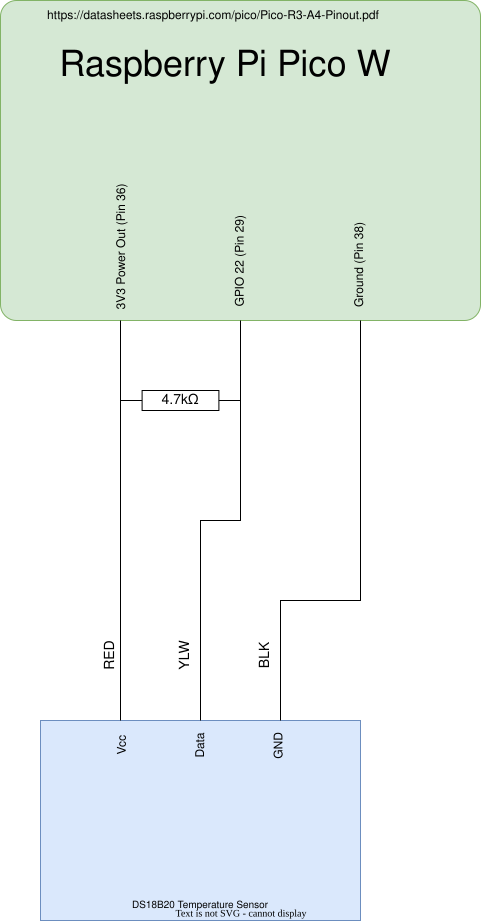

# Software Setup for RPI Pico W

## 1. Download MicroPython Firmware
Put the device into BOOT mode and copy the correct UF2 file (named something like RPI_PICO_W-20241025-v1.24.0.uf2) onto the system. If this is a new RPI Pico W, it will automatically start in BOOT mode. Additional instructions can be found on the official Raspberry Pi website <https://www.raspberrypi.com/documentation/microcontrollers/micropython.html#drag-and-drop-micropython>

## 2. Install Required MicroPython Library
From Thonny, go to "Tools...Manage packages...", search for "micropython-umqtt.simple" and install it.

## 3. Configure Credentials and Broker Settings
Ensure `src/config.yaml` has valid values for:
- wifi_ssid
- wifi_password
- hostname
- mqtt_server
- mqtt_port
- mqtt_user
- mqtt_password
- mqtt_keepalive
- mqtt_client_id

## 4. Copy Files to the Pico
Copy these files to the Pico root:
- `src/main.py`
- `src/config.yaml`

## 5. Reboot and Verify
Power cycle the Pico after copying files.

The script is designed for headless operation and will:
- retry WiFi and MQTT with bounded backoff
- use watchdog recovery
- publish periodic status heartbeat data

# Home Assistant Setup
The `configuration.yaml` file in Home Assistant must be updated to connect MQTT topics.

## Current MQTT Topic List
- home/outside/temperature_garage
- home/outside/temperature_fermenter_1
- home/outside/temperature_fermenter_2
- home/outside/brewery/tilt/blue/temperature
- home/outside/brewery/tilt/blue/gravity
- home/outside/tilt/blue/rssi
- home/outside/brewery/tilt/blue/data
- home/outside/brewery/tilt/green/temperature
- home/outside/brewery/tilt/green/gravity
- home/outside/tilt/green/rssi
- home/outside/brewery/tilt/green/data
- home/outside/brewery/system/status

## Example configuration.yaml
```yaml
mqtt:
  sensor:
    - name: "Garage Temperature"
      unique_id: "sensor.garage_temperature"
      state_topic: "home/outside/temperature_garage"
      device_class: "temperature"
      unit_of_measurement: "°F"
      suggested_display_precision: 1

    - name: "Fermenter 1 Temperature"
      unique_id: "sensor.fermenter_1_temperature"
      state_topic: "home/outside/temperature_fermenter_1"
      device_class: "temperature"
      unit_of_measurement: "°F"
      suggested_display_precision: 1

    - name: "Blue Tilt Gravity"
      unique_id: "sensor.blue_tilt_gravity"
      state_topic: "home/outside/brewery/tilt/blue/gravity"
      suggested_display_precision: 3

    - name: "Blue Tilt Temperature"
      unique_id: "sensor.blue_tilt_temperature"
      state_topic: "home/outside/brewery/tilt/blue/temperature"
      device_class: "temperature"
      unit_of_measurement: "°F"
      suggested_display_precision: 0

    - name: "Brewery Monitor Uptime"
      unique_id: "sensor.brewery_monitor_uptime"
      state_topic: "home/outside/brewery/system/status"
      value_template: "{{ value_json.uptime_s }}"
      unit_of_measurement: "s"
      suggested_display_precision: 0
```

# Runtime Behavior Summary
- BLE IRQ handler only queues raw scan data. Parsing and publishing run in the main loop.
- MQTT reconnect uses bounded retry backoff.
- Watchdog is enabled for automatic recovery from hangs.
- Runtime state is persisted in `runtime_state.json` (boot count and reset causes).
- Status heartbeat is published every `STATUS_PUBLISH_INTERVAL_S` seconds.

# Hardware Setup
## Schematic (RPI Pico W)


## Reference Website
https://randomnerdtutorials.com/raspberry-pi-pico-ds18b20-micropython/

Note: The code has been updated beyond the reference implementation to improve runtime stability and headless operation.
